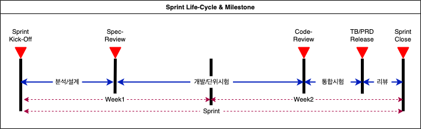

# Sprint Life-Cycle & Milestones

## Sprint Life-Cycle

Sprint Life-Cycle은 분석/설계 &gt; 개발/단위시험 &gt; 통합시험 &gt; 리뷰의 단계를 갖는다.

* 분석/설계단계: 상세 과제\(필수: 개발명세서, UI기획서, 선택: Flow-Chart, 테이블정의서\)별 Sub-Task 생성 수행
* 개발/단위시험: 개발 및 단위시험 수, 통합시험 수행을 위한 테스트시나리오 작성 Sub-Task 생성 수행
* 통합시험: 개발환경 내 개발팀/운영팀 통합 시험 수행
* 리뷰단계: 사용자메뉴얼 작성 Sub-Task 수행

## Sprint Milestones

스프린트 라이프사이클 내 주요 마일스톤은 아래와 같다.

* Sprint Kick-Off: 1주차 월요일 10:00 ~ 11:00
  * Epic Breakdown 및 담당자 Assign
* Spec-Review: 1주차 수요일 10:00 ~ 12:00
* Code-Review: 2주차 수요일 09:00 ~ 12:00
* TB/PRD Release
  * TB Release: 2주차 수요일 13:00, EPC 개발환경
  * PRD Release 2주차 목요일 19:00 ~, G-Cloud, EPC, AI통화비서 운영환경
* Sprint Close: 2주차 금요일 18:00

