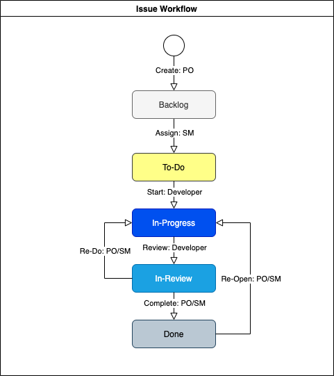

# Issue Workflow

## Issue Status

각 이슈는 이슈 유형에 관계없이 아래 5단계의 상태를 거처 완료된다.

1. Backlog: 최초 이슈 등록 상태이며, 이슈 등록은 PO\(Product Owner\)에 의해 진행된다.
2. To-Do: 등록된 이슈가 개발자에게 할당된 상태이며, 이슈 할당은 SM\(Scrum Master\)에 의해 진행된다. 
3. In-Progress: 할당 받은 이슈를 Developer가 작업을 착수한 상태이며, Developer에 의해 착수가 진행된다.
4. In-Review: 할당 받은 이슈를 Developer가 작업을 완료한 상태, Developer에 의해 리뷰 요청이 진행된다.
5. Done: Reviewer \(Peer, SM, PO\)에 작업 완료가 확인된 상태, Reviewer에 의해 작업 완료가 진행된다

## Issue Workflow

다음 그림은 이슈의 처리 흐름\(Issue Workflow\)을 나타낸다.

