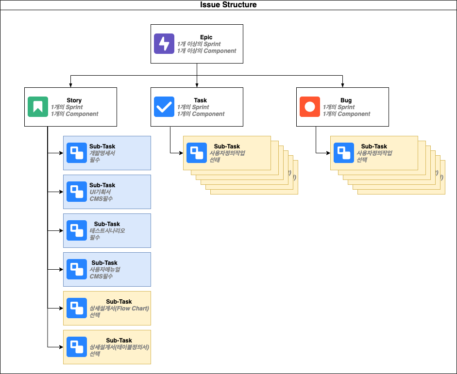

# Issue Structure

## Issue Types

프로젝트에서 사용하는 이슈는 Epic, Story, Task, Bug, Sub-Task 5가지로 구분한다.

* Epic: 1개 이상의 Sprint 또는 1개 이상의 Component 연관된 이슈인 경우, Story, Task, Bug로 세분화 될 수 있으며, Sprint 및 Component의 개수, 할당된 Developer 인원 등에 따라 여러 개의 세분화된 Story, Task, Bug를 각각 생성한다.
* Story: 1개 Sprint, 1개 Component 및 한 명의 Developer로 구성된 개발 요구사항으로, 수행해야하는 개발산출물 유형에 따라 Sub-Task를 각각 생성한다.
* Task: 개발 외 별도로 수행해야 하는 작업으로, Sub-Task을 생성하여 작업을 세분화할 수 있고 Sub-Task 없어 이슈가 수행될 수 있다
* Bug: 개발과정 또는 운영과정에서 확인된 오류로, Sub-Task을 생성하여 작업을 세분화할 수 있고 Sub-Task 없어 이슈가 수행될 수 있다
* Sub-Task: 이슈의 최하위 레벨로 통상 3~5일 동안 수행하는 최소 단위 작업으로, 개발 요구사항이 정의된 Story의 경우 개발산출물 유형\(필수: 개발명세서, UI기획서\(CMS\), 테스트시나리오, 사용자메뉴얼\(CMS\), 선택: 상세설계서\(Flow Chart\), 상세설계서\(테이블명세서\)\)에 따라 세분화되어 생성한다.

## Issue Structure

다음 그림은 프로젝트 이슈 구조를 나타내고 있다.

 Story, Task, Bug 및 Sub-Task는 쉽게 구분할 수 있도록 Prefix을 가지며, Prefix 명명 규칙은 다음과 같다.

* Story/Task/Bug Prefix 명명규칙: 이슈 명칭 앞에 "_**\[Component Name\]**_"을 Prefix로 사용한다.
* Sub-Task Prefix 명명규칙: 이슈 명칭 앞에 "_**\[Component Name-산출물명\]**_"을 Prefix로 사용한다.

